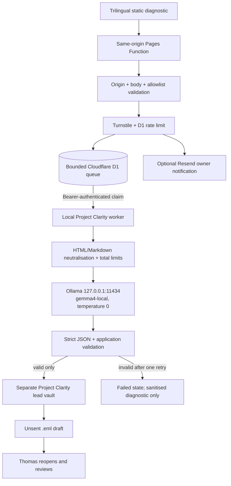

# Project Clarity architecture

## Public/private boundary

The public website never connects to Ollama, Studio, Hermes, Gmail, either Obsidian vault, a shell, a browser or a filesystem. The local worker claims one item at a time over HTTPS. Ports 11434 and 11435 remain bound to loopback and no tunnel is introduced.

## Why D1 instead of mailbox polling

The existing Resend path can notify the owner, but mailbox polling would require granting a local worker a mailbox OAuth credential not approved for this project. A small D1 queue is safer for this MVP because it provides bounded payloads, a unique idempotency constraint, durable state and rate-limit counters without Gmail access. The queue exposes only two bearer-protected worker operations: claim one eligible item and update that item's state. There is no arbitrary lookup endpoint.

## State model

`queued → processing → needs-review → completed`

Failure is terminal as `failed`. A processing lease expires after ten minutes. At most two claims are allowed. Invalid model output never creates a note or draft.

## Environment template

All names are also in `.env.example`; values below are intentionally absent.

| Scope | Name | Secret | Purpose |
| --- | --- | --- | --- |
| Build/browser | `NEXT_PUBLIC_TURNSTILE_SITE_KEY` | No | Turnstile widget site key |
| Build/browser | `NEXT_PUBLIC_PROJECT_CLARITY_LEGAL_READY` | No | Enables final consent UI only after approval |
| Pages Function | `TURNSTILE_SECRET_KEY` | Yes | Server-side Siteverify |
| Pages Function | `RESEND_API_KEY` | Yes | Owner notifications/contact delivery |
| Pages Function | `RESEND_TO` | Yes | Approved owner mailbox |
| Pages Function | `PROJECT_CLARITY_WORKER_TOKEN` | Yes | Worker claim/state authentication |
| Pages Function | `PROJECT_CLARITY_SUBMISSIONS_ENABLED` | No | Runtime release gate |
| Pages Function | `PROJECT_CLARITY_LEGAL_APPROVED` | No | Independent legal gate |
| Pages Function | `PROJECT_CLARITY_CONSENT_VERSION` | No | Exact approved consent version |
| Pages Function | `PROJECT_CLARITY_RETENTION_DAYS` | No | Approved duration; no default exists |
| Pages binding | `PROJECT_CLARITY_DB` | No | D1 queue/rate limits |
| Local worker | `PROJECT_CLARITY_QUEUE_URL` | No | HTTPS preview/production origin |
| Local worker | `PROJECT_CLARITY_LEAD_VAULT` | No | Separate lead vault |
| Local guard | `PROJECT_CLARITY_PERSONAL_VAULT` | No | Comparison only; never read |
| Local worker | `OLLAMA_URL` | No | Must equal `http://127.0.0.1:11434` |
| Local worker | `OLLAMA_MODEL` | No | Allowlisted `gemma4-local` profile |

## Lead vault schema

Flat YAML properties:

- `submission_id`
- `created_at`
- `updated_at`
- `language`
- `buyer_type`
- `status`
- `consent_version`
- `retention_until`
- `source`
- `report_schema_version`
- `draft_message_id`

Detailed visitor text and the validated report are Markdown body content. Attachment bytes are never stored. Obvious payment/authentication data and API-key patterns are redacted. The Obsidian URI percent-encodes the vault and note path.

## Retention

No public retention period is coded by default. Activation fails closed unless `PROJECT_CLARITY_RETENTION_DAYS` and an approved consent version are present. `npm run clarity:retention` previews only completed/failed notes whose `retention_until` has passed. A separate command moves explicit candidates to recoverable `.trash/YYYY-MM-DD`; permanent deletion requires `--confirm-permanent-delete`.
